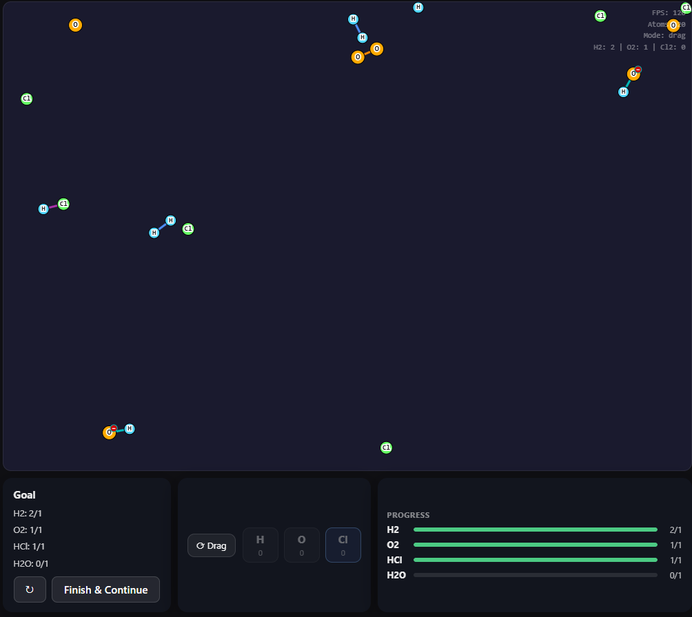
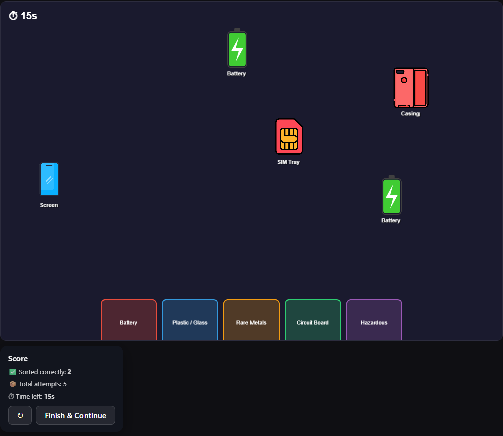

# SGFramework.js

A modular, web-based game framework for serious games with built-in telemetry and session lifecycle management.

Developed as part of a Master's thesis at the University of Applied Sciences Upper Austria (Hagenberg), Interactive Media program.


## Overview

SGFramework.js addresses a common problem in serious game development: existing web-based game engines and frameworks handle rendering and physics well, but leave session handling, structured progression, and telemetry to be re-implemented separately for every project. SGFramework.js treats these concerns as first-class, framework-owned features.

Games connect to the framework through a small adapter interface. The framework owns:

- Session lifecycle management (introduction, simulation, quiz, and feedback phases)

- Quiz and feedback rendering

- Level progression and a data-driven level system

- A built-in, privacy-aware telemetry module

Two prototype games were built to validate the design:

- **Chemistry game** — a physics-driven atom-building simulation rendered with the HTML5 Canvas 2D API and Matter.js

- **Recycling game** — an electronics sorting game rendered with PixiJS

Both games use the same framework core without modification, demonstrating that session handling, telemetry, and level progression are reusable across different rendering backends.

| Chemistry game | Recycling game |

|---|---|

|  |  |

## Project Structure

```

src/

├── framework/          Framework core (owned by SGFramework.js, game-agnostic)

│   ├── createFramework.js

│   ├── levelSchema.js

│   ├── physicsSchema.js

│   ├── sessionUi.js

│   ├── state.js

│   └── telemetry.js

├── games/

│   ├── chemistry/       Chemistry prototype (Canvas 2D + Matter.js)

│   └── recycling/       Recycling prototype (PixiJS)

├── physics/

│   └── matterProvider.js

├── renderers/

│   ├── render.js

│   └── renderPixi.js

└── ui/

    ├── gameUi.js

    └── input.js

```

The `framework/` directory has no dependency on either game. Both games communicate with the framework exclusively through the public API exposed by `createFramework()`.

## Getting Started

### Prerequisites

- A modern browser with WebGL support (for the PixiJS-based recycling game)
- A Supabase project for level content and telemetry storage (see Configuration below)

### Installation

```bash
git clone https://github.com/AhmedSh4hien/serious-play-framework
cd serious-play-framework
npm install
```

### Running locally

```bash
npm run dev
```

### Configuration

Level content and telemetry records are stored in Supabase. Create a `.env` file in the project root with:
  
```
SUPABASE_URL=your-supabase-url

SUPABASE_ANON_KEY=your-supabase-anon-key
```

Level records are stored in a Supabase table and loaded via a REST query filtered by `game_id` at session start.

## Architecture

- **Adapter pattern.** A game connects to the framework by implementing a small set of lifecycle methods (e.g. `resetGame()`, `update()`, `render()`). The framework never accesses renderer-specific internals directly.
- **Renderer-agnostic design.** The framework owns two DOM surfaces: the game canvas container (populated by whichever rendering backend the game chooses) and an overlay layer (rendered as HTML/CSS, used for quiz, feedback, and session UI). This allows Canvas 2D, WebGL via PixiJS, or any other browser-compatible rendering technology to sit underneath the same session and telemetry infrastructure.
- **Telemetry.** The telemetry module is instantiated internally and is never directly accessible to game code. Games log events through `api.logEvent(name, data)`. Two buffers are maintained: a discrete event buffer (e.g. `quiz_answered`, `goal_completed`) and a periodic sample buffer recording frame rate, phase, and progress at one-second intervals. Data is flushed to the backend at the quiz-to-feedback transition, with a `beforeunload` safety flush as a fallback. No personally identifiable information is collected; session identifiers are random UUIDs with no link to user accounts or devices.

## Evaluation Summary

- **Reusability.** Session handling, telemetry, quiz/feedback rendering, and level progression were inherited by the recycling game from the chemistry game without modification.
- **Renderer independence.** The same five-method adapter interface was used for both the Canvas 2D/Matter.js chemistry game and the PixiJS recycling game.
- **Performance.** At up to 250 simultaneously active particles, all tested implementations maintained acceptable frame rates on both a development PC and a Microsoft Surface Go 2. At higher particle counts, performance degrades on constrained hardware.